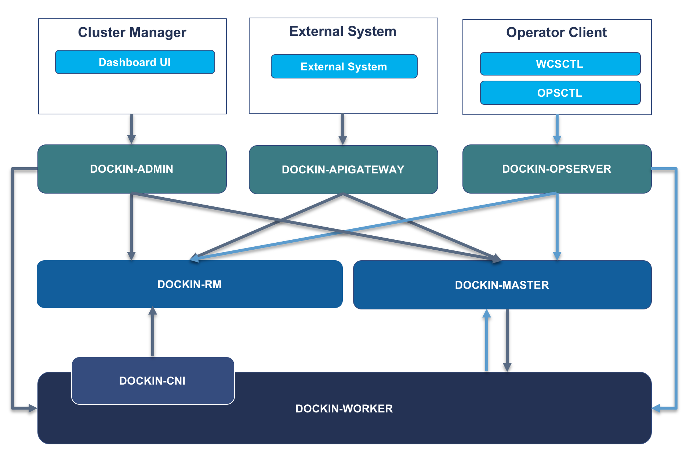

# Dockin RM - Dockin Resource Manager

[English](README.md) | 中文

Dockin容器平台资源管理器，是应用定义和容器实例管理的核心模块，提供容器分配、回收、查询等功能。



## Features

* **0.1.0**
    * 支持Dockin-CNI插件网络信息查询
    * 支持Dockin-Opserver容器查询

## Installation

### Minimum Requirements

* **JDK**
  * ≥ 1.8

* **Gradle**
  * ≥ 4.3

## QuickStart

#### 导入数据库表
- 登录MySQL控制台并执行sql文件 
```
mysql -u <username> -p <password>

mysql> source <The absolute path of the sql file>
```

#### 项目构建
- 当前项目构建使用gradle，构建方法：
进入工程目录下，执行以下命令

```
gradle build
```

#### 程序运行
- 执行以下命令运行代码（这里不添加jvm参数，若需要可自行制定）
```
java -jar dockin-rm-v1.0.0.jar --spring.config.location=<path of 'application.properties' and 'application-database.properties'>
```
